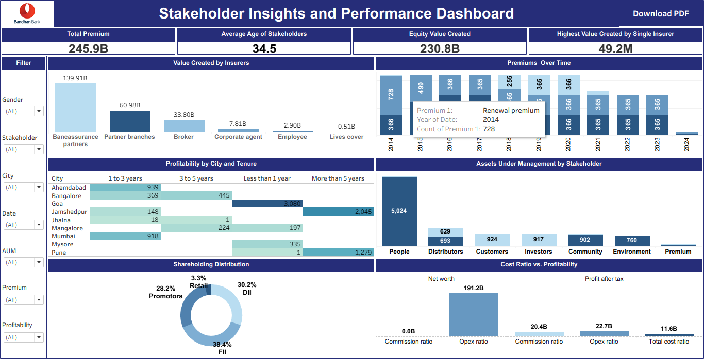

# Stakeholder Insights and Performance Dashboard

A comprehensive Tableau dashboard to analyze stakeholder performance, insurer contributions, and policy metrics across a financial dataset. This project visualizes critical KPIs such as value creation, cost efficiency, premium trends, and demographic insights, helping stakeholders make informed, data-driven decisions.

## Live Dashboard

- **View on Tableau Public**  
 [Click here to open the interactive dashboard](https://public.tableau.com/views/StakeholderInsightsandPerformanceDashboard_17516959777410/StakeholderInsightsandPerformanceDashboard?:language=en-US&publish=yes&:sid=&:redirect=auth&:display_count=n&:origin=viz_share_link)

## Purpose

The dashboard provides a unified view of key business metrics across stakeholders and insurers. It helps in:
- Understanding premium trends over time
- Identifying high-value insurers
- Analyzing cost vs profitability
- Visualizing demographic and tenure distributions
- Making investment and policy decisions based on real data

## Features and Visualizations

### Charts and Visuals
- **Total Value Created by Insurers**: Compare which insurer groups created the most value.
- **Premium Trends Over Time**: Line charts track premium types (new, renewal, single) across time.
- **Shareholding Pattern Distribution**: Pie and bar charts represent promoter, DII, FII, retail ownership.
- **Cost Ratio vs Profitability**: Scatter plot to analyze operational efficiency and profit trends.
- **Profitability by City & Tenure**: Heatmaps/bar charts categorize profit based on geography and policy age.
- **Asset Distribution by Stakeholder**: Visualizes whether stakeholders manage equity vs. debt assets.

### Key Performance Indicators (KPIs)
- **Total Premium Collected**: Aggregated premium across all types.
- **Average Stakeholder Age**: Insights into target demographics.
- **Value Created (Equity Management)**: Value where AUM = Equity.
- **Highest Value by Single Insurer**: Top individual row with maximum value created.

### Filters & Interactivity
- **City Filter**: Narrow down regionally.
- **Stakeholder Filter**: Focus on specific stakeholder categories.
- **Policy Tenure Range Slider**: Interactive filtering by policy duration.
- **Date Range Filter**: Select specific periods of interest.
- **Gender Filter**: Segment data by gender.
- **Click-to-Filter**: Clicking on any chart segment filters other charts accordingly.
- **Tooltips**: Hover for additional data and insights.
- **Dynamic KPI Updates**: KPIs respond instantly to all filter changes.

### Exporting Options
- **PDF Export Button**: Downloads current dashboard view.
- **Includes All Filters, Charts, and KPIs** in the export snapshot.

## Usage Instructions

### Navigating the Dashboard:
- Use filters at the top/side to refine data by **city**, **tenure**, **date**, **stakeholder**, or **gender**.
- Click on chart elements (e.g., bars, pie segments) to dynamically filter other visuals.
- Hover over any chart to get detailed **tooltips** showing values, ratios, and more.

### Exporting the Dashboard:
- Click the **Export to PDF** button on the toolbar.
- The exported PDF includes:
  - All visible **charts**, **KPIs**, and **filters**
  - A light **company watermark**
  - The current filtered state of the dashboard

## Tools Used

| Tool      | Purpose                              |
|-----------|--------------------------------------|
| **Tableau** | Data visualization and interactivity |
| **Excel** | Data cleaning and source file     |

